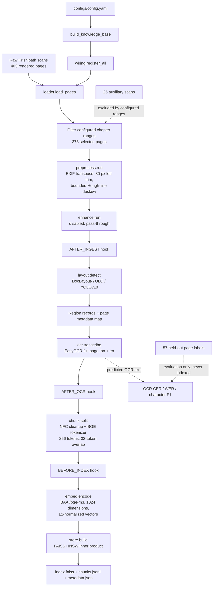

# Knowledge-base pipeline diagram (A2)

This diagram covers the implemented A2 knowledge-base build only. Retrieval,
the agent loop, reranking, citations, serving, and RL are deliberately omitted
because they are later-milestone work.

## Stage behavior

| Stage | Implemented behavior |
|---|---|
| Load | `loader.load_pages()` discovers supported image files and keeps only pages in configured chapter ranges. |
| Preprocess | `preprocess.run()` writes derived PNGs without changing raw images. It applies EXIF orientation, a left-gutter trim, and bounded consensus deskewing. |
| Enhance | `enhance.run()` remains in the fixed pipeline order but is a pass-through because `enhance.enabled: false`. No optional enhancement model is part of the A2 run. |
| Layout | `layout.detect()` uses `juliozhao/DocLayout-YOLO-DocStructBench` through DocLayout-YOLO / YOLOv10. Regions provide structural metadata and reading order. |
| OCR | `ocr.transcribe()` uses EasyOCR with Bengali and English. It transcribes each processed page in full rather than only detected boxes, preventing observed crop-related omissions. |
| Chunk | `chunk.split()` NFC-normalizes source OCR text, preserves paragraph grouping, and creates BGE-tokenizer windows of 256 tokens with 32-token overlap. |
| Embed | `embed.encode()` creates 1024-dimensional, L2-normalized BGE-M3 vectors. |
| Store | `store.build()` writes a FAISS `IndexHNSWFlat` inner-product index plus JSONL chunks and JSON metadata. |

## Runtime and audit boundaries

The committed configuration uses `device: cpu` for a reliable baseline on the
teammate machine whose installed Torch build cannot run kernels on its `sm_120`
GPU. The standalone Kaggle preprocessing/OCR script accepts an explicit GPU
selection for a compatible Kaggle accelerator; that setting does not alter the
committed A2 configuration.

`data.validate.validate()` and `data.versioning.snapshot()` are available
integrity utilities, but `build_knowledge_base()` does not invoke them yet.
They should be run and their results recorded with the final index build rather
than represented as automatic pipeline artifacts.

## Produced artifacts

| Artifact | Location |
|---|---|
| Raw scans | `data/raw/krishipath/` |
| Derived scans | `data/interim/preprocessed/` |
| FAISS index | `data/index/index.faiss` |
| Chunk records | `data/index/chunks.jsonl` |
| Index metadata | `data/index/metadata.json` |
| Held-out OCR labels | `grading_kit/heldout_pages/` and `grading_kit/labels.jsonl` |
